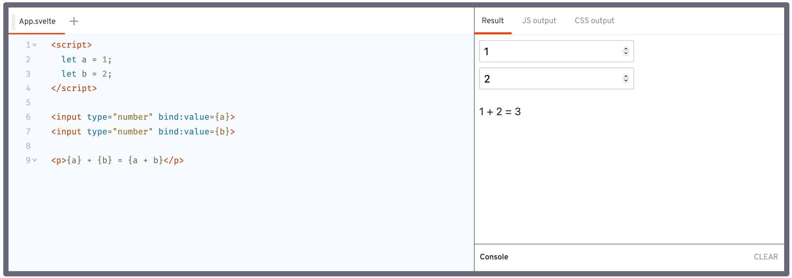
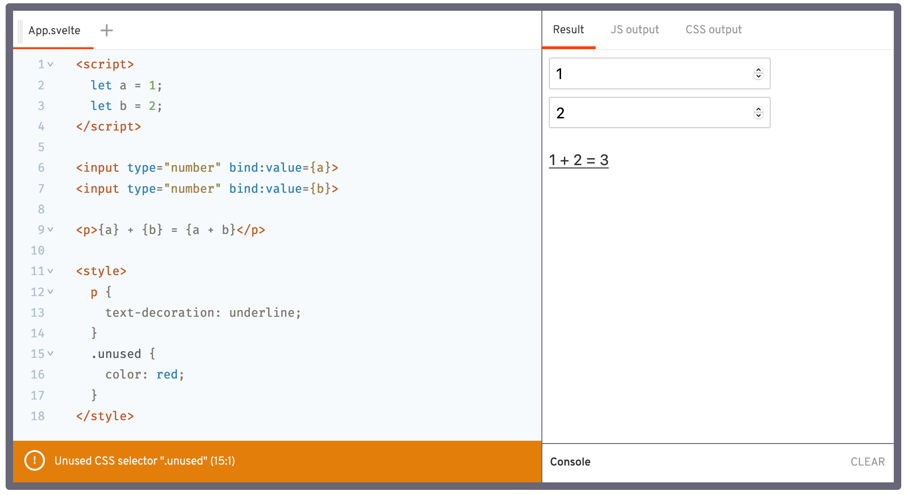
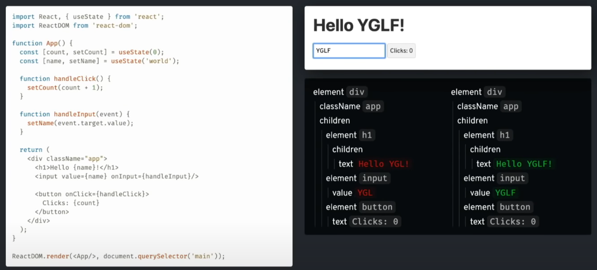
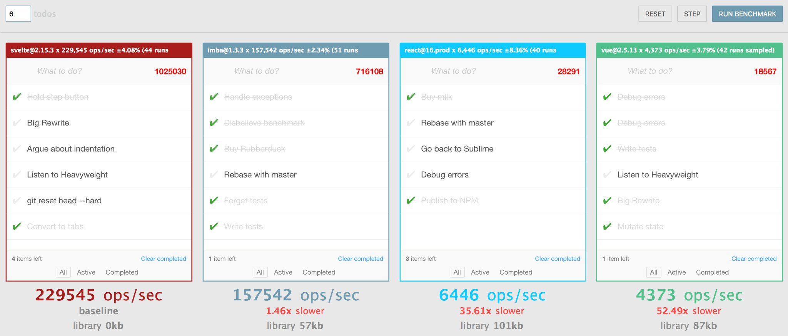

<br><br><br><br><br><hr><br><br><br><br><br>

## Velkommen
### Svelte: Et _faktisk_ reaktivt rammeverk

* Hvem er jeg?
  * Kristian
  * KomTek 4. klasse
* Hvorfor snakke om Svelte?

<br><br><br><br><br><hr><br><br><br><br><br>

## abakusrevyen.no
```
commit b9129dfedbda60305e5643b97ad558fd0b2e2ead
Author: Kristian <kristianint@outlook.com>
Date:   Thu Mar 4 03:27:28 2021 +0100

    init
```
### _Permiære 5. Mars_

<br><br><br><br><br><hr><br><br><br><br><br>

## Dagens mål:
* Hva er Svelte
* Hva er Sapper
* Hvorfor bry seg om performance?
* Et par eksempler
* Nok kunnskap til å starte et nytt prosjekt

<br><br><br><br><br><hr><br><br><br><br><br>

## Hvorfor bry seg om <u>Svelte</u>?
_adjective `/svelt/` attractively thin, graceful and stylish_
* Enklere kode
* Mindre boilerplate
* Raskt og ressurseffektivt
  * Ingen Virtual DOM
  * Reaktiv oppdatering av variabler
* God støtte for CSS

<br><br><br><br><br><hr><br><br><br><br><br>

Typisk Svelte komponent:



_Legg merke til:_
* Enkel HTML kode
* Reaktiv: 
	* Ingen states, hooks eller andre unødvendige wrappers
* Ingen update funksjoner, binder til native HTML element

<br><br><br><br><br><hr><br><br><br><br><br>

## Samme komponent i React:
```javascript
import React, { useState } from 'react';

export default () => {
  const [a, setA] = useState(1);
  const [b, setB] = useState(2);

  function handleChangeA(event) {
    setA(+event.target.value);
  }

  function handleChangeB(event) {
    setB(+event.target.value);
  }

  return (
    <div>
      <input type="number" value={a} onChange={handleChangeA}/>
      <input type="number" value={b} onChange={handleChangeB}/>

      <p>{a} + {b} = {a + b}</p>
    </div>
  );
};
```
_Jeeez, så mye boilerplate!_

<br><br><br><br><br><hr><br><br><br><br><br>

## Vue er litt bedre:
```javascript
<template>
  <div>
    <input type="number" v-model.number="a">
    <input type="number" v-model.number="b">

    <p>{{a}} + {{b}} = {{a + b}}</p>
  </div>
</template>

<script>
  export default {
    data: function() {
      return {
        a: 1,
        b: 2
      };
    }
  };
</script>
```

<br><br><br><br><br><hr><br><br><br><br><br>

## Stats:
|||
--- | ---
|React|442|
|Vue|263|
|Svelte|145|
|
Generel basis: Svelte 40% mindre code enn React

<br><br><br><br><br><hr><br><br><br><br><br>

## Hva om man ønsker litt styling i tillegg?



**Gjør det rett i samme komponent!**

<br><br><br><br><br><hr><br><br><br><br><br>

## Hva er Virtual DOM?


<br><br><br><br><br><hr><br><br><br><br><br>

## Virtual DOM rendrer hele applikasjon internt **HVER LOOP!**
Untak:
* shouldComponentUpdate
* React.PureComponent
* useMemo
* useCallback

^ Dette burde jo være jobben til kompilatoren \
^ Lett å gjøre feil

<br><br><br><br><br><hr><br><br><br><br><br>

## Hvordan oppdage og oppdatere state?
* React setState (gammel)
* React UseState (ny)

Vue:
```javascript
data: () => ({count: 0})
this.count += 1
```
Under-the-hood skjer det en del magi her i runtime.\
Dette er dessverre regler for javascript 😕

Men svelte bryr seg ikke! Svelte er en compiler tross alt!

<br><br><br><br><br><hr><br><br><br><br><br>

### Ok, svelte er kjapt, men har det noe å si?


<br><br><br><br><br><hr><br><br><br><br><br>

## Måling av User Experience:
https://rethinking-reactivity.surge.sh/#slide=24 \
https://rethinking-reactivity.surge.sh/#slide=25

<br><br><br><br><br><hr><br><br><br><br><br>

## Hva er da Sapper?
### SSR (Server Side Rendering) rammeverk drevet av Svelte
* React: Next.js, Gatsby

<br>

Eksempel prosjekt: \
https://github.com/kristianvld/abakusrevyen-streamsite

<br><br><br><br><br><hr><br><br><br><br><br>

## SSR vs CSR?

### SSR (Server-Side Rendering):
```html
<h1>Hello World!</h1>
```
`Server -> Browser -> DOM`
<br/>

### CSR (Client-Side Rendering):
```javascript
const h1 = document.createElement('h1');
h1.innerText = 'Hello World!';
document.body.appendChild(h1);
```
`Server -> Browser -> Javascript Engine -> DOM`


<br><br><br><br><br><hr><br><br><br><br><br>

```bash
# For Rollup
npx degit "sveltejs/sapper-template#rollup" my-app
# For webpack
npx degit "sveltejs/sapper-template#webpack" my-app
cd my-app

npm install
npm run dev
# Åpne http://localhost:3000
```

<br><br><br><br><br><hr><br><br><br><br><br>

## _Så har me juksa litt_
## [sapper-eksempel](./sapper-eksempel/)

<br><br><br><br><br><hr><br><br><br><br><br>

## La oss se på et lite eksempel prosjekt

<br><br><br><br><br><hr><br><br><br><br><br>

## For mer info og interaktiv tutorial:
### [svelte.dev](https://svelte.dev)
### [sapper.svelte.dev](https://sapper.svelte.dev/)

<br/>

## Om du har spørsmål eller bare vil chatte:
### <u>Discord</u>: `null#3702`
* Abakus Discord: `Kristian in't Veld`
* Eller still spørsmål i `#koseprogg`
### Abakus <u>Slack</u>: `Kristian in't Veld`

<br/>

Slides og eksempel prosjekt finnes her: \
https://github.com/kristianvld/svelte-wtf